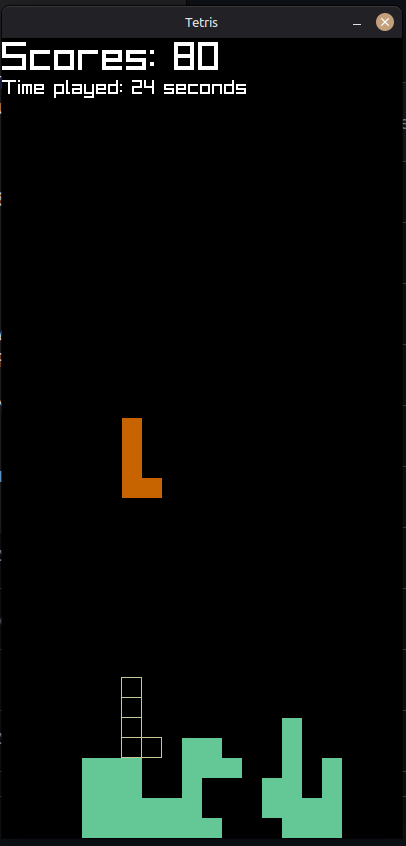

# Tetris

I tried to create Tetris using C++ and Raylib. 

> 100% code written by me. No AI Code-Completion/Generation is used while making this project.



## How To Play

- Press <kbd>A</kbd> or <kbd>Arrow Left</kbd> to move left.
- Press <kbd>S</kbd> to <kbd>Arrow Down</kbd> move down.
- Press <kbd>D</kbd> to <kbd>Arrow Right</kbd> move right.
- Press <kbd>Space</kbd> to insta-place.
- Press <kbd>Q</kbd> to rotate counter-clockwise.
- Press <kbd>E</kbd> to rotate clockwise.

## Run with Docker

Build docker image

```bash
git clone <this repo>
docker build -t tetris . -f web.Dockerfile
docker run --rm -p 8080:80 tetris
```

Open http://localhost:8080

## Build

cmake --preset default
cmake --build out/build/default
ctest --test-dir out/build/default

## TODO

- Multi Color (Optional)
- Sounds
- Web Support (WASM)
- Add Game Over
- GitHub Action auto release & deploy